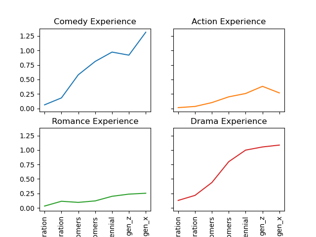

---
# Feel free to add content and custom Front Matter to this file.
# To modify the layout, see https://jekyllrb.com/docs/themes/#overriding-theme-defaults

layout: page
---

All actors have their own motivation to work hard and be part of movies that have large veiwership and recognition. The motivation could be either financial success or great praise for their work by critics and the auidence.



We will explore the relationship between actor/actress experience and movie success/popularity with goals of forming a descriptive analysis of actor-feature data to summarize and compare successful actor profiles from different generations.

### Why is this interesting and what are the benefits?

Movie studios and production companies constantly strive to assemble casts that will lead to successful movies, both financially and critically. By exploring the relationship between actor/actress experience and movie success/popularity, we can gain valuable insights into the factors that contribute to a movie's success. This information can be useful for movie studios and production companies as they make casting decisions for future projects, as well as for actors and actresses looking to advance their careers.

In addition to understanding what factors contribute to movie success, our analysis can also help us identify trends in the characteristics of successful actors. By comparing successful actor profiles from different generations, we can see how the qualities and experiences that lead to success have changed over time. This information can be useful for actors and actresses looking to succeed in the industry, as it can help them understand what qualities and experiences are likely to lead to success in their careers.

Our analysis also has the potential to inform future research on the relationship between actor/actress characteristics and movie success. By providing a foundation for further research, we can help researchers build on our findings to explore this topic in more depth or to examine other factors that may contribute to movie success.

Finally, our analysis could inform policy decisions related to the film industry. For example, if we find that certain actor characteristics are associated with movie success, policymakers may consider ways to support and promote actors with these characteristics. This could include initiatives to increase diversity in the industry or to provide training and development opportunities for actors with the most promising characteristics. By understanding the factors that contribute to movie success, we can help policymakers make informed decisions about how to support and promote the film industry.

# Trends through time
### We analyze the career trajectories of actors/actresses
we use the information about the number of movies each actor/actress had starred in before each movie to see how their career has progressed over time. Can plot the average IMDB rating of the movies they have appeared in over time and see if there are any trends.

### Examining the impact of actor/actress experience on movie genre:
Using the information about actor/actress experience, we see if there is a relationship with the genre of the movie. For example, do more experienced actors/actresses tend to star in certain genres more frequently?

### also
It could be a good idea to analyze the relationship between actor/actress experience and movie success, as well as other factors, for different time periods. Doing this could allow us to see if there are any trends or patterns that differ between the different eras. For example, we can compare the average experience of leading actors/actresses in movies released during the baby boomer era versus the millennial era and see if there are any differences.

It's important to keep in mind that making a distinction between different time periods could also introduce other variables that could influence the results of your analysis. For example, there may be differences in movie-making technology, audience preferences, or economic conditions that could affect the success of a movie and confound the relationship between actor/actress experience and movie success. We  need to consider these factors and try to control for them in your analysis as per what the assistant said.

# However we remain aware of the potential confounders
When analyzing the relationship between actor/actress experience and movie success for different time periods there are unobserved latent variables that might be implicitly affecting our results

  - Movie-making technology: The technology available for making movies can change over time, and this could potentially impact the success of a movie. For example, advances in special effects or cinematography could make a movie more visually appealing and impact its box office success.

  - Audience preferences: The preferences of moviegoers can also change over time. What may have been popular in one era may not be as popular in another. It's important to consider how audience preferences may have changed over the different time periods we are analyzing.

  - Economic conditions: Economic conditions can also impact the success of a movie. For example, during times of economic downturn, people may be less likely to go to the movies or may have less disposable income to spend on entertainment. It's important to consider how economic conditions may have differed between the different time periods we are analyzing.

  - There are other factors that could potentially impact the success of a movie, such as the quality of the script, the marketing campaign, or the performance of the actors. Unfortunately we can't possible have access to such information, but we can shield our selves by using a sensitivity analysis model (what we saw in week 6 of class)

### Some ideas to control confounding variables
- Stratified analysis : We divide our data into subgroups that depend on time periods (think baby boomer era vs gen Z era for example) to reduce the impact of the previously considered confounders; movies in the same time-period are much more likely to be made using similar technology and during comparable economic conditions.  We can see how audience preference shifts through time (by seeing how the top movies genres vary through time for example) 

We recognize that it is impossible to completely encapsulate the effect of the confounders, but we hope that by taking them into consideration and communicating the limits of our analysis we are increasing the validity of our analysis.

# Without IMDB revenue, only average rating and number of votes, we can still...
...explore the relationship between actor/actress experience and movie success. Just use the IMDB average movie rating as a measure of movie success, and the number of votes as a proxy for the popularity of the movie.

Idea:
create a scatterplot to visualize the relationship between actor/actress experience and IMDB average movie rating. We can fit a regression model to predict IMDB average movie rating based on actor/actress experience, and use the number of votes as a control variable to account for the popularity of the movie. This would allow us to see if there is a relationship between actor/actress experience and movie success, controlling for the popularity of the movie.

Of course, there are still drawbacks; using IMDB average movie rating and the number of votes as a measure of movie success has some limitations. For example, these measures may not be directly related to box office revenue, and there could be other factors that influence the IMDB rating or the number of votes a movie receives that are not related to the quality or success of the movie. However, using these measures can still provide valuable insights into the relationship between actor/actress experience and movie success.

# Correlation between actor features and success metrics (building credibility for our chosen features)

Linear relations between the actor features and also with ratings, revenue and budget

| Feature    | Description       | 
|:-------------|:------------------|
| Age                   | Age of the actor |
| Experience            | Number of movies as lead actor before the time of realease of the movie   |
| Genre background      | Vector showing the different type of genres the actor has worked in - signifying diversity    |
| Gender                | Actor:0/Actress:1 |

## Non-trivial difference between popularity and critical acclaim []
The quote 
> Whether the work that I do shall succeed or achieve critical acclaim is for the audience to decide.

by Amitabh Bhachan is proof that there is difference between the two still remains non-trivial

Many movies such as Tenet, Avatar and other huge budget movies backed by very well acclaimed directors have lead to success by both metrics.
# How do actor profiles change over time ?? Does it suggest something

## Have a comparison of features based on different success metrics

##### lifetime of an actor in a genre - first movie to last movie

# Do Actors stick to the same genre in the current generation ?

Having studied the trends in actor experience and audience perference over past generation, we are now going to look at the current state of the movie industry which is GenX. We filtered out certain movie genres in order to help make obersvations about general trends in the diversity of an actor's genre background and preference. So we filtered out animation movies, biographies and documentaries as they feature voice actors, or casting based on the subject. This was to remove a dependance on features such as voice, language or the specific subject the movie is about. 

Here we see that the major genres are Drama, Comedy, Crime, Action, Romance. Now we wish to chose 4 g

We see that 

## genre entropy for actors
We define a diversity metric called genre entropy to represent if an actor has ventured into many different genres or stuck to the genre of movies they have already worked on

Using number of votes on the imdb ratings of their past movies as a popularity metric we plot the "genre entropy" for the top 10 female and male actors in GenX.

# Conclusion

We attempt to provide a data science approach to movie casting based on correlations with success and trends over time, to identify patterns and features that may be important in deciding who is a better fit to play the leading role for your movie. In this attempt we also try to quantify differences if any between the recipe to get awards or make money, with exceptions both (masterpiece) or neither (flops)
* * *

# Datastory 
* Analytical approach to casting, what features matter based on type of movie you want to make (genre)
* Notion of genre background to signify the acting background and see how it relates to movie genres. (finding trends)

# Task 1 - Credibility (Hoa and Arvind)
*   Reveal actor feature corrrelations with ratings and number of votes
*   Count genre pairs and trends to find frequent genre pairs and use this to establish that there are genre patterns in movies
*   Covariance matrix for the actor features to show any patterns or redundancy

# Task 2 - actor features over various generations (Johnny + Sid)
* non-weighted and weighted with averages over generations for various features
* gender analysis to plot distribution of genre's of the experience actors for each generation and genre
* Add to the story and show trends in the shift towards building a more diverse "GENRE BACKGROUND" 

# Task 3 - Successful trends in actor features that are favourable in the current generation (Arvind)
* Visualizations to represent favour profiles and actor names, experience, specific to each genre
* Calculate weighted actor features to suggest a good ideal actor profile

dummy

# Conclusion
* what actor features to look when your movie has a particular genre and you want to assemble a cast
* How to choose a career path as an actor based on your current experience, which genres are easy to get into, which ones are the long games, which ones can lead to a faster path to critical acclaim, good ratings and popularity