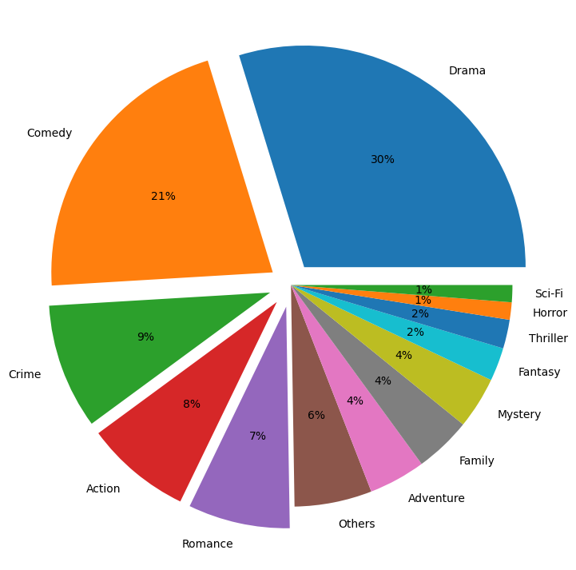

---
# Feel free to add content and custom Front Matter to this file.
# To modify the layout, see https://jekyllrb.com/docs/themes/#overriding-theme-defaults

layout: page
---


All actors have their own motivation to work hard and be part of movies that have large veiwership and recognition. The motivation could be either financial success or great praise for their work by critics and the auidence.

We will explore the relationship between actor/actress experience and movie success/popularity with goals of forming a descriptive analysis of actor-feature data to summarize and compare successful actor profiles from different generations.

### Why is this interesting and what are the benefits?

Movie studios and production companies constantly strive to assemble casts that will lead to successful movies, both financially and critically. By exploring the relationship between actor/actress experience and movie success/popularity, we can gain valuable insights into the factors that contribute to a movie's success. This information can be useful for movie studios and production companies as they make casting decisions for future projects, as well as for actors and actresses looking to advance their careers.

In addition to understanding what factors contribute to movie success, our analysis can also help us identify trends in the characteristics of successful actors. By comparing successful actor profiles from different generations, we can see how the qualities and experiences that lead to success have changed over time. This information can be useful for actors and actresses looking to succeed in the industry, as it can help them understand what qualities and experiences are likely to lead to success in their careers.

Our analysis also has the potential to inform future research on the relationship between actor/actress characteristics and movie success. By providing a foundation for further research, we can help researchers build on our findings to explore this topic in more depth or to examine other factors that may contribute to movie success.

Finally, our analysis could inform policy decisions related to the film industry. For example, if we find that certain actor characteristics are associated with movie success, policymakers may consider ways to support and promote actors with these characteristics. This could include initiatives to increase diversity in the industry or to provide training and development opportunities for actors with the most promising characteristics. By understanding the factors that contribute to movie success, we can help policymakers make informed decisions about how to support and promote the film industry.

## Genre analysis

This section will look at the hidden patterns of the film industry's genres and examine how various film genres can affect an actor's professional career.

# Distribution of genres in the movie industry.

Typically, a single film can be classified as many film genres. It's pretty intricate how various film genres interact with one another. The frequency of movie genre combinations in our base movie dataset will be displayed by a chord diagram, where the width of the connection lines denotes the frequency, in order to provide a clear picture of the genre pattern that existed in the film business. Several genres were removed from the diagram based on how frequently they appeared in our dataset, leaving only the most widely used genres. We can see that the drama genre is closely related to the other genres, which suggests that a drama movie will be a wise choice if rookie actors are unsure of what to look for in their debut movie. because it will give them vital experience that many films can use. Meanwhile, we see that there is a strong association between certain genre pairs, such as comedy and family, action and adventure. Additionally, if two movie genres are significantly connected, we anticipate that an actor or actress with appropriate prior acting experience in one genre will benefit from landing a job in the other.


# Investigating impact of movie experience.

We develop features about each actor or actress's experience in each well-known film genre—drama, action, romance, comedy, crime, war, family, and mystery—in order to substantiate the aforementioned claim. In light of this, we make movie-actor pairs using all of the films and actors in our dataset. Now, we have statistical information on the actor's experience in all prominent movie genres that depicts the actor's background before filming the movie. We assume that an actor who has already appeared in films of the same genre has a higher chance of landing a role when they audition. By using a correlation analysis, we can determine which types of movie experiences will increase our chances of landing a role in a new film. In the next figure, in each row, we first selected movies of the same genre G and then computed pairwise correlation of genre G with other genres. A higher correlation value means a greater chance of landing a part in the appropriate film. For instance, the majority of film genres exhibit strong correlations with drama. If you were never involved in a romance movie and you want to get a chance to film a romance movie, the experience of drama and comedy movies will help you to survive the audition. These results, we believe, will assist aspiring actors in exploring their career under supervision.


# Analysis of movie experience over the generations
We now know movie experience caters to the success of actors and actresses, thus it is worth looking at it in more detail especially how it changed over the generations. To do this, we examine the number of movies each actor/actress had starred in before each movie which inter alia reveals how their career has progressed over time. Looking at the graph "Average Actor Movie Experience Before Movie Start", we can clearly see that the trend for having more experienced actors in a cast is certainly there. This is, however, the overall view. Therefore, unexperienced actors do not necessarily need to worry to not be picked for roles. Or should they? The answer is as often: it depends. In this case it depends on the genre which the graph "Average Actor Movie Experience Before Movie Start Per Genre" proves. For instance, the genres "Drama" and "Action" require on average a movie experience of below half a movie. As a result, these two genres can be regarded as the historic breeding soil and playground for unexperienced actors to start their career. Are thus these genres the best ones to start with if you want to become an actor? Answers to this will come later.


For this purpose we should first investigate the dominance of a genre in every generation. 


# Top 1000 Popular movies imdb dataset


# Conclusion

We attempt to provide a data science approach to movie casting based on correlations with success and trends over time, to identify patterns and features that may be important in deciding who is a better fit to play the leading role for your movie. In this attempt we also try to quantify differences if any between the recipe to get awards or make money, with exceptions both (masterpiece) or neither (flops)
* * *

# Datastory 
* Analytical approach to casting, what features matter based on type of movie you want to make (genre)
* Notion of genre background to signify the acting background and see how it relates to movie genres. (finding trends)

# Task 1 - Credibility (Hao and Arvind)
*   Reveal actor feature corrrelations with ratings and number of votes
*   Count genre pairs and trends to find frequent genre pairs and use this to establish that there are genre patterns in movies
*   Covariance matrix for the actor features to show any patterns or redundancy

# Task 2 - actor features over various generations (Johnny + Sid)
* non-weighted and weighted with averages over generations for various features
* gender analysis to plot distribution of genre's of the experience actors for each generation and genre
* Add to the story and show trends in the shift towards building a more diverse "GENRE BACKGROUND" 

# Task 3 - Successful trends in actor features that are favourable in the current generation (Arvind)
* Visualizations to represent favour profiles and actor names, experience, specific to each genre
* Calculate weighted actor features to suggest a good ideal actor profile

dummy

# Conclusion
* what actor features to look when your movie has a particular genre and you want to assemble a cast
* How to choose a career path as an actor based on your current experience, which genres are easy to get into, which ones are the long games, which ones can lead to a faster path to critical acclaim, good ratings and popularity

```
Long, single-line code blocks should not wrap. They should horizontally scroll if they are too long. This line should be long enough to demonstrate this.
```

```
The final element.
```