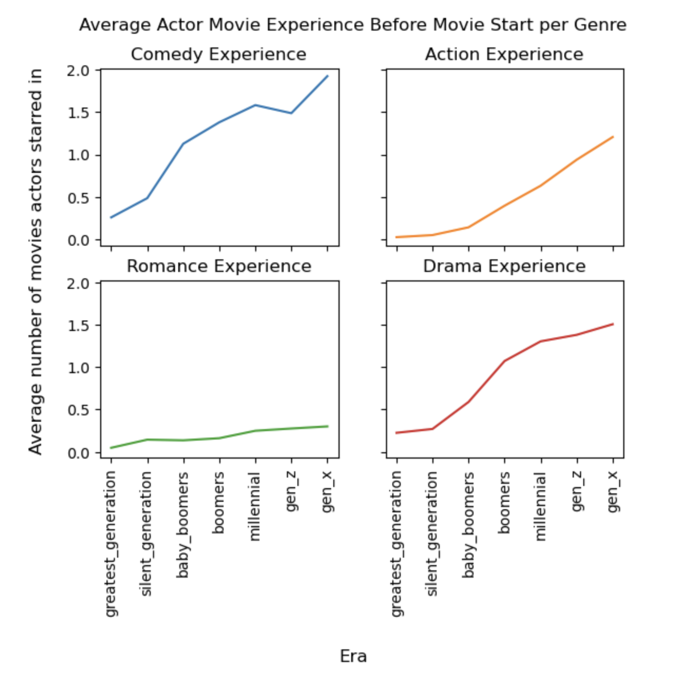
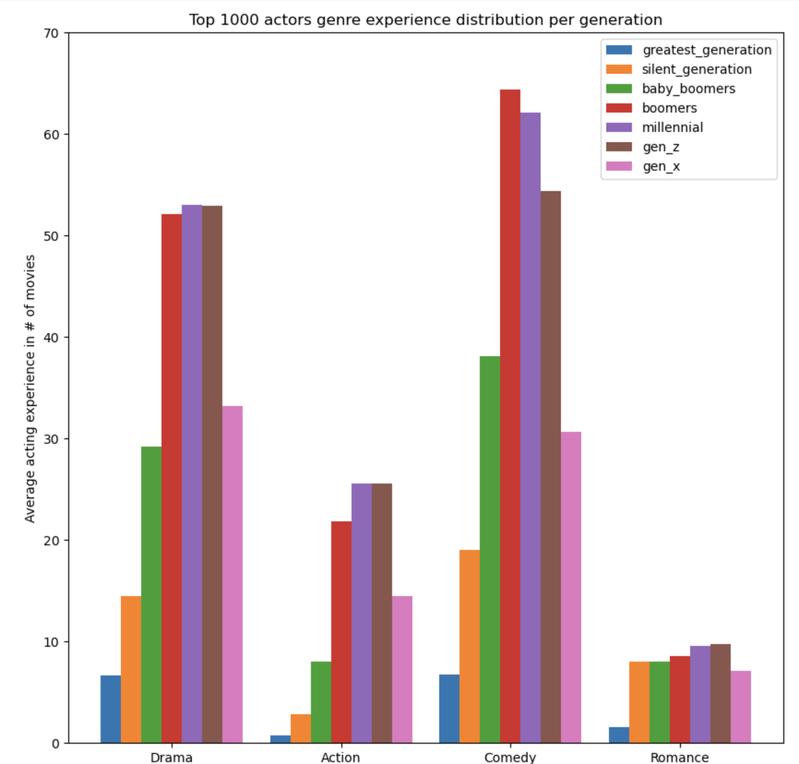
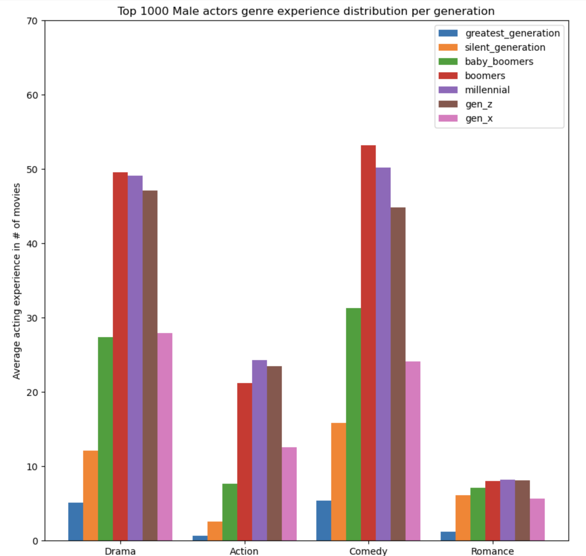
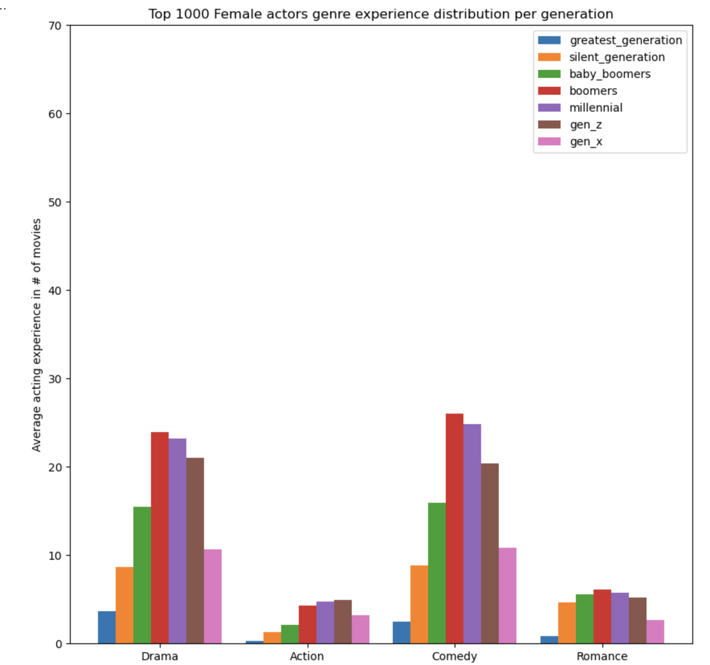
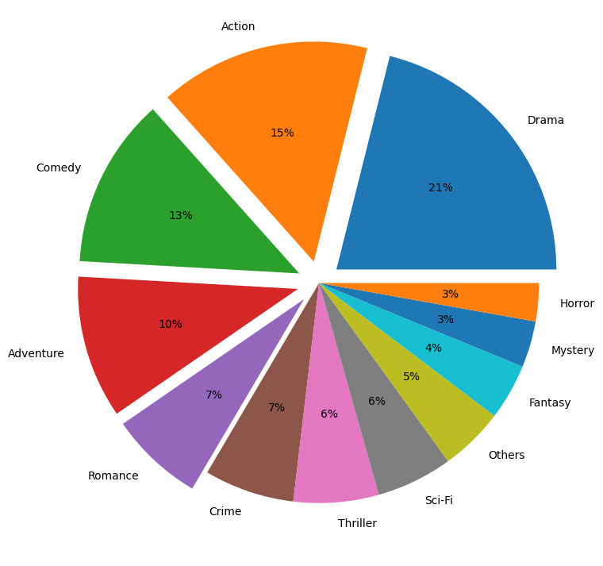
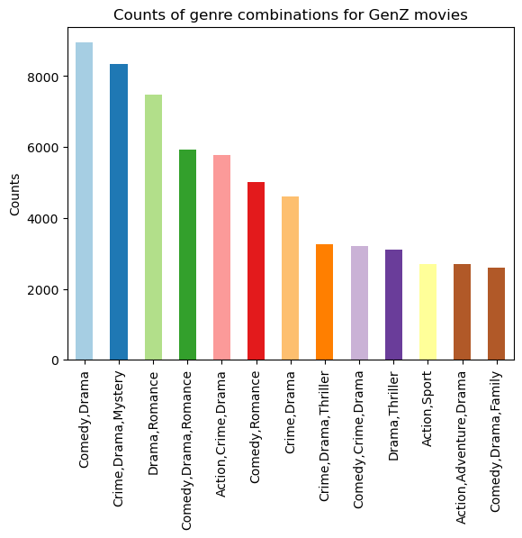
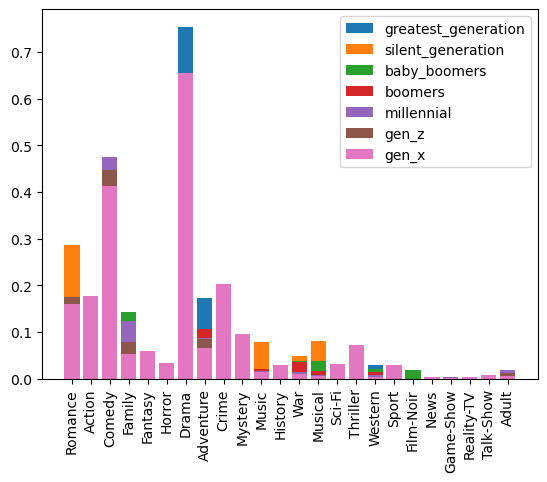
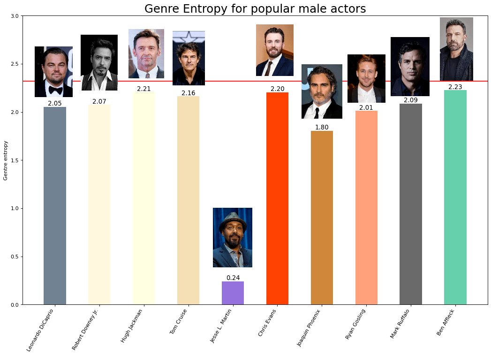
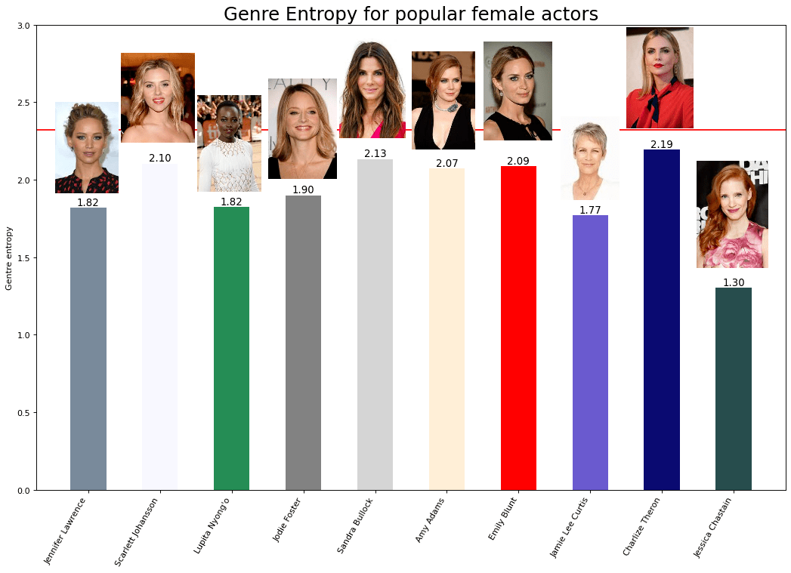

---
# Feel free to add content and custom Front Matter to this file.
# To modify the layout, see https://jekyllrb.com/docs/themes/#overriding-theme-defaults

layout: page
---

All actors have their own motivation to work hard and be part of movies that have large veiwership and recognition. The motivation could be either financial success or great praise for their work by critics and the auidence.

We will explore the relationship between different movie genres and also trends in actor/actress experience to study the career paths they have followed to make certain observations about how the industry has evolved and understand what popular actors have done to have a successful career in the movie industry.

# Why is this interesting and what are the benefits?

Movie studios and production companies constantly strive to make popular movies that entertain it's audience while also getting good ratings from the mass population. We study how movies have changed their strategies over different generations to satisfy the audience preference at that time. We think that the **evolution in casting decisions and movie genre choices** has a lot to be learnt from in order to better understand the current state of the movie industry.

<!--
**Without IMDb Box Office data**: Since this is a paid resource we chose to find a new way to quantify success for a movie. We study these trends using two different success metrics - **Ratings and Populartiy**. We already have the IMDb ratings but how do we measure popularity?

 This information can be useful for movie studios and production companies as they make casting decisions for future projects, as well as for actors and actresses looking to advance their careers. 

| Rating   |   Popularity   | 
|:-------------|:------------------|
| Average IMDb rating                   | Number of votes for the IMDb rating |

Why did we chose this? 
$$ \text{Correlation(Average Rating, Number of votes)} = 0.02$$

This suggets that they are very weakly correlated and are good candidates for features to look at our data from different perspectives.

By observing the trends in the features of successful actor profiles from different generations, we can see how the qualities and experiences that lead to success have changed over time. This information can be useful for actors and actresses looking to succeed in the industry, as it can help them understand what qualities and experiences are likely to lead to success in their careers. -->

<!-- Finally, our analysis could inform policy decisions related to the film industry. For example, if we find that certain actor characteristics are associated with movie success, policymakers may consider ways to support and promote actors with these characteristics. This could include initiatives to increase diversity in the industry or to provide training and development opportunities for actors with the most promising characteristics. By understanding the factors that contribute to movie success, we can help policymakers make informed decisions about how to support and promote the film industry. -->

<!--
# Genre analysis

This section will look at the hidden patterns of the film industry's genres and examine how various film genres can affect an actor's professional career.-->

# Analysis of genres in the movie industry

Typically, a single film can be classified as many film genres. It's pretty intricate how various film genres interact with one another. The frequency of movie genre combinations in our base movie dataset will be displayed by a chord diagram, where the width of the connection lines denotes the frequency, in order to provide a clear picture of the genre pattern that existed in the film business. 

Several genres were removed from the diagram based on how frequently they appeared in our dataset, leaving only the most widely used genres. We can see that the drama genre is closely related to the other genres, which suggests that a drama movie will be a wise choice if rookie actors are unsure of what to look for in their debut movie because it will give them vital experience that many films can use. Meanwhile, we see that there is a strong association between certain genre pairs, such as comedy and family, action and adventure. Additionally, if two movie genres are significantly connected, we anticipate that an actor or actress with appropriate prior acting experience in one genre will benefit from landing a job in the other. Let's further investigate this matter...

# Investigating impact of movie experience

We develop features about each actor or actress's experience in each well-known film genre—drama, action, romance, comedy, crime, war, family, and mystery in order to substantiate the aforementioned claim. In light of this, we make movie-actor pairs using all of the films and actors in our dataset. Now, we have statistical information on the actor's experience in all prominent movie genres that depicts the actor's background before filming the movie. We assume that an actor who has already appeared in films of the same genre has a higher chance of landing a role when they audition. By using a correlation analysis, we can determine which types of movie experiences will increase actors' chances of getting a role in a new film. 



In the figure above, for each row we first selected movies of the same genre G and then computed pairwise correlation of genre G with other genres. A higher correlation value means a greater chance of landing a part in the appropriate film. For instance, the majority of film genres exhibit strong correlations with drama. If you were never involved in a romance movie and you want to get a chance to film a romance movie, the experience of drama and comedy movies will help you to survive the audition. These results, we believe, will assist aspiring actors in exploring their career under supervision.

# Analysis of movie experience over the generations
We now know movie experience caters to the success of actors and actresses, thus it is worth looking at it in more detail - especially how it changed over the generations. To do so, we first divide our dataset into subgroups defined by when the movies were released. The reasoning is better explained later on; in a nutshell it is part of a stratified analysis we conduct. The following generations are considered:

    Greatest Generation (born circa 1901 to 1924)
    Silent Generation (circa 1925 to 1945)
    Baby Boomers (circa 1946 to 1964)
    Boomers (circa 1965 to 1985)
    Millennial Generation (circa 1985 to 1996)
    Gen Z (post-Millennial) (circa 1997 to 2012)
    Gen X (circa 2013+)
    
 To ultimately analyse movie experience over time, we examine the number of movies each leading actor/actress had starred in as lead before each movie which inter alia reveals how their career has progressed over time. If a an actor is led or not, is determined by IMDB - our data source for this analysis. Looking at the graph "Average Actor Movie Experience Before Movie Start", we can clearly see that the trend for having more experienced actors in a cast is certainly there. This is, however, the overall view. Therefore, unexperienced actors do not necessarily need to worry to not be picked for roles. Or should they? The answer is as often: it depends. In this case it depends on the genre which the graph "Average Actor Movie Experience Before Movie Start Per Genre" proves. 

For instance, a century ago the genres "Drama" and "Action" required on average a movie experience of below half a movie. However in the latest generations, these two genres alongside "Comedy" have a much higher average starting point when looking at the average data of leading actors.

On the other hand, the "Romance" genre has the slowest increasing slope when it comes to the average bar of movie experience for leading actors in the field. To this day, leading romance actors have less than 1 movie experience when starring in romance movies. As a result, this genre can be regarded as the historic breeding soil and playground for unexperienced actors to start their career. Considering the conclusions from our earlier analysis of movie experience's impact, we can argue that one of the most common career paths is to firstly shot a movie in Romance and then continue acting as lead in Drama or Comedy.

<!--
## Moving on...
It could be a good idea to analyze the relationship between actor/actress experience and movie success, as well as other factors, for different time periods. Doing this could allow us to see if there are any trends or patterns that differ between the different eras. For example, we can compare the average experience of leading actors/actresses in movies released during the baby boomer era versus the millennial era and see if there are any differences.

It's important to keep in mind that making a distinction between different time periods could also introduce other variables that could influence the results of your analysis. For example, there may be differences in movie-making technology, audience preferences, or economic conditions that could affect the success of a movie and confound the relationship between actor/actress experience and movie success. We  need to consider these factors and try to control them.
-->

## Looking at the top 1000 actors only
For further inspection, we pick out the top 1000 actors in all of the considered generations and calculate the distribution of their experience per movie genre and end up with the following graph. 

As it can be seen for the four main genres, the first 3 generations we are considering generally see a strict increase in actor experience for all genres, but starts plateauing between the `boomers` and `gen_z` generations. These are generally the generations considered to be a "golden age of cinema" with rapid technological advancements due to an outpouring of funding which saw the release of many popular and critically acclaimed movies. 

However, the latest `gen_x` is not to be necessarily discounted either; the seeming drop in average acting experience of the top 1000 actors/actresses could be due to the fact that the generation is still ongoing, and that the talents contributing to these statistics are still growing.

It is also interesting to make a distinction between male and female actors in our analysis, as there may be differences in the distribution of experience among male and female actors in different movie genres. So we look the above again while differentiating between the top actors and actresses.

The most notable matter we first realize is that we still observe the same overall trend of average acting experience increasing during the first generations and then plateauing. However, there remains stark differences too.

We find that male actors tend to have more experience in `Drama`, `Action` and `Comedy` while both genders have comparable experience in `Romance` movies. This could suggest differences in the types of roles that are available to male and female actors, and the way that their careers are developed within the film industry.

Overall, it is clear to see that the top male actors have almost twice as much average experience than female actors. It is not uncommon for male actors to have more experience than female actors in the film industry, as men have historically been more represented in leading roles and have often had more opportunities to work on a wider range of projects. This is a clear bias between males and females; it suggests that there are significant disparities in the career opportunities available to male and female actors within the film industry. It could also indicate that male actors are more likely to be cast in lead roles of the studied genres. On the other hand, it could also be interpreted in a way that favors aspiring female actors; on average you need less movie experience than men to be recognized as a top female actor.

## However we remain aware of the potential confounders
When analyzing the relationship between actor/actress experience and movie success for different time periods there are unobserved latent variables that might be implicitly affecting our results

  - Movie-making technology: The technology available for making movies can change over time, and this could potentially impact the success of a movie. For example, advances in special effects or cinematography could make a movie more visually appealing and impact its box office success.

  - Audience preferences: The preferences of moviegoers can also change over time. What may have been popular in one era may not be as popular in another. It's important to consider how audience preferences may have changed over the different time periods we are analyzing.

  - Economic conditions: Economic conditions can also impact the success of a movie. For example, during times of economic downturn, people may be less likely to go to the movies or may have less disposable income to spend on entertainment. It's important to consider how economic conditions may have differed between the different time periods we are analyzing.

  - There are other factors that could potentially impact the success of a movie, such as the quality of the script, the marketing campaign, or the performance of the actors. Unfortunately we can't possible have access to such information, but we can shield our selves by using a sensitivity analysis model (what we saw in week 6 of class)

### Some ideas we implemented to control confounding variables
- Stratified analysis : We divided our data into subgroups that depend on time periods (think baby boomer era vs gen Z era for example) to reduce the impact of the previously considered confounders; movies in the same time-period are much more likely to be made using similar technology and during comparable economic conditions.  We can see how audience preference shifts through time (by seeing how the top movies genres vary through time for example) 

We recognize that it is impossible to completely encapsulate the effect of the confounders, but we hope that by taking them into consideration and communicating the limits of our analysis we are increasing the validity of our analysis.

<!-- # Without IMDB revenue, only average rating and number of votes, we can still...
...explore the relationship between actor/actress experience and movie success. Just use the IMDB average movie rating as a measure of movie success, and the number of votes as a proxy for the popularity of the movie. -->

<!-- Idea: -->
<!-- create a scatterplot to visualize the relationship between actor/actress experience and IMDB average movie rating. We can fit a regression model to predict IMDB average movie rating based on actor/actress experience, and use the number of votes as a control variable to account for the popularity of the movie. This would allow us to see if there is a relationship between actor/actress experience and movie success, controlling for the popularity of the movie. -->

Of course, there are still drawbacks; using IMDB average movie rating and the number of votes as a measure of movie success has some limitations. For example, these measures may not be directly related to box office revenue, and there could be other factors that influence the IMDB rating or the number of votes a movie receives that are not related to the quality or success of the movie. However, using these measures can still provide valuable insights into the relationship between actor/actress experience and movie success.

<!-- # Correlation between actor features and success metrics (building credibility for our chosen features)

Linear relations between the actor features and also with ratings, revenue and budget

| Feature    | Description       | 
|:-------------|:------------------|
| Age                   | Age of the actor |
| Experience            | Number of movies as lead actor before the time of realease of the movie   |
| Genre background      | Vector showing the different type of genres the actor has worked in - signifying diversity    |
| Gender                | Actor:0/Actress:1 | -->

<<<<<<< HEAD
<!-- ## Non-trivial difference between popularity and critical acclaim []
=======
<!--
## Non-trivial difference between popularity and critical acclaim []
>>>>>>> 6bb49a57f209c559e967c1e9587b2c85c17ebe44
The quote 
> Whether the work that I do shall succeed or achieve critical acclaim is for the audience to decide.

by Amitabh Bhachan is proof that there is difference between the two still remains non-trivial

Many movies such as Tenet, Avatar and other huge budget movies backed by very well acclaimed directors have lead to success by both metrics. -->

<!-- # How do actor profiles change over time ?? Does it suggest something

## Have a comparison of features based on different success metrics

<<<<<<< HEAD
##### lifetime of an actor in a genre - first movie to last movie -->

# Do Actors stick to the same genre in the current generation [2013-] ?
=======
##### lifetime of an actor in a genre - first movie to last movie-->

# What about the current generation?
>>>>>>> 6bb49a57f209c559e967c1e9587b2c85c17ebe44

Having studied the trends in actor experience and audience perference over past generation, we are now going to study the GenZ movie industry. 

In order to study general trends between actors and genres, we **filtered out certain genres such as Animation, Biographies and Documentaries** as they might only feature voice actors, or depend heavily on the subject of the movie.

The current movies dataset consists of movies released between the period 2013 - now, from many different genres.

Here we see that the major genres are Drama, Comedy, Crime, Action, Romance. We also have many movies with multiple genres. Popular combinations of genres are :

With the increase in the scale of movie production and the constant demand of the audience, we see that movies now belong to many different genres and not often a single one. It is then the requirement for actors to adapt to this situation and be comfortable playing roles which are very diverse in nature, in order to have a long illustruous career. 

The downside of not adapting would be to rinse and repeat the same type of movies until your audience gets tires of it, or be known as a "one hit wonder" forver hiding in the shadow of the fame acquired from the success of a movie in the past.
 

## Do Leading movie actor/actresses stick to the same genre?

We must now quantify the diversity of an actor's career in the movie industry. For this we use the genres of the movies in which they played a leading role and categorize them into 5 major genres - 

* Drama
* Romance
* Comedy
* Action
* Adventure

We add up the movie counts weighted by their IMDb ratings in order to filter out flops, and calculate an vector denoting - 

$$
  V_g = [ \text{  Drama Experience ,  Romance Experience, Comedy Experience, Action Experience, Adventure Experience }]
$$

Now we wish to calculate whether this vector is more uniform or skewed towards a particular set of genres. We do this by calculating something that we made up called "genre entropy".

### Genre entropy for actors
We define a diversity metric called genre entropy (GE) to represent if an actor has ventured into many different genres or stuck to the genre of movies they have already worked on. We first normalize the vector $V_g$ to represent a probabilistic distribution for the genre choices made by the actor/actress and then calculate the shannon's entropy($H$) of this vector. So simply put,

$$
 \text{Genre Entropy (GE)} = H(\text{normalized}(V_g))
$$

For this purpose we should first investigate the dominance of a genre in every generation. 

Using number of votes on the imdb ratings of their past movies as a popularity metric we plot the "genre entropy" for the top 10 male and female actors in GenZ.

# Conclusion

We attempt to provide a data science approach to movie casting based on correlations with success and trends over time, to identify patterns and features that may be important in deciding who is a better fit to play the leading role for your movie. In this attempt we also try to quantify differences if any between the recipe to get awards or make money, with exceptions both (masterpiece) or neither (flops)

* what actor features to look when your movie has a particular genre and you want to assemble a cast
* How to choose a career path as an actor based on your current experience, which genres are easy to get into, which ones are the long games, which ones can lead to a faster path to critical acclaim, good ratings and popularity

* * *
